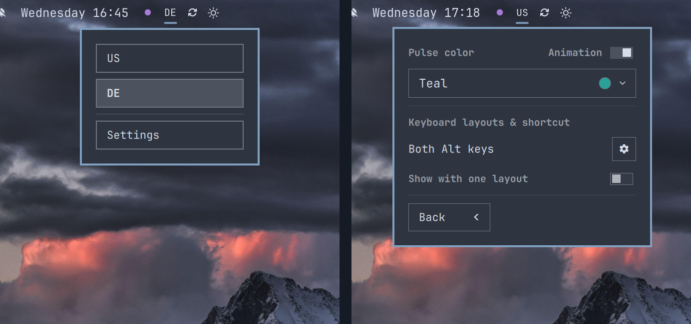

# Keyboard Layout Pulse



A compact keyboard-layout picker for the Omarchy Quattro bar. It shows the
active XKB layout, opens a native layout menu, and optionally pulses after a
layout change to improve visual confirmation of the layout change.

## Requirements

- Omarchy Quattro: >= 4.0.0
- x86-64 for optional per-window layouts
- `json-c` for optional per-window layouts, included with Omarchy
- One or more keyboard layouts configured in `~/.config/hypr/input.lua`

The optional per-window mode runs a bundled helper only while it is enabled. It
does not install a system service.

## Install

```bash
omarchy plugin add https://github.com/PraiseTheDuck/omarchy-keyboard-layout.git
```

The plugin replaces Omarchy's built-in `omarchy.keyboard-layout` bar widget.
Removing or disabling the plugin restores the built-in widget in the same
position.

## Use

- Click the layout label to choose a configured language.
- Scroll over the label to move to the next or previous language.
- Open **Settings** from the language menu to customize the widget.
- Enable **Show with one layout** to keep the widget visible with one layout.
- Under settings, toggle on/off:
  - animation (pulsing + colored indicator)
  - show icon even for one layout enabled (never hide top level language icon)
  - per-window layout tracing; each hyprland window keeps track of layout
  - Latin in menu and terminal (requires per-window layouts); uses the first
    layout while the Omarchy menu or a terminal is focused, without overwriting
    the remembered layout of other windows

## Demo

See layouts change using the bar and keyboard shortcuts, choose a pulse color,
add languages, and change the switching shortcut from double `Ctrl` to double
`Alt`.

<https://github.com/user-attachments/assets/9e631b8e-f155-45d1-9731-567414712d6a>

## Animation and color

Animation is enabled by default. After a layout change, the label pulses using
the selected color.

Turn **Animation** off for an immediate, plain layout change with no pulse,
scale effect, or accent color. The color controls become shaded and inactive;
the selected color remains saved for the next time Animation is enabled.

The color dropdown puts **Custom** first, followed by fixed presets:

- Teal: `#2aa198`
- Purple: `#a77bd8`
- Blue: `#3b82f6`
- Nord yellow: `#ebcb8b`

Custom accepts exactly six-digit hex colors such as `#2aa191`. **Apply** saves
the color and closes the menu.

## Layouts and keybindings

The plugin reads the effective layouts and `grp:*` switching option directly
from Hyprland. It translates XKB descriptions into friendly names such as **Both
Alt keys** and **Super + Space**.

Use the gear beside the displayed shortcut to open its owning line in
`~/.config/hypr/input.lua` with `nvim`.

The plugin never rewrites the Hyprland input file. Layout and keybinding changes
remain owned by Omarchy and Hyprland.

Enable **Activate per-window layouts** to remember the active layout separately
for each open window. Disabling it stops the bundled helper and returns to one
layout shared across windows. Automatic restores do not trigger the pulse, so
the animation continues to identify manual layout changes.

**Latin in menu and terminal** is on by default once per-window layouts are
enabled. It switches to the first configured layout (usually Latin, such as
`us` or `it`) while the Omarchy menu or a terminal is focused, then restores
the remembered layout of the window you return to. The forced Latin switch is
not stored as that window's layout, so opening Super+Space over a Russian
browser does not teach the browser Latin. Turn the option off in Settings if
you want terminals to keep their own layouts.

## Remove

```bash
omarchy plugin remove io.github.ilyazar.keyboard-layout --yes
```

Removal also deletes the plugin's saved appearance, visibility, and per-window
preferences.

## License

MIT
